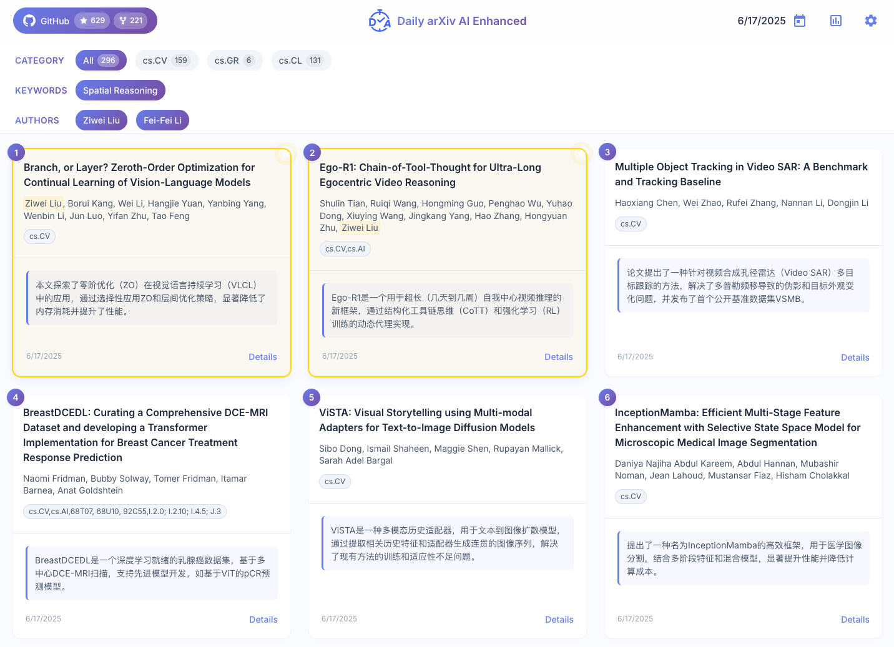
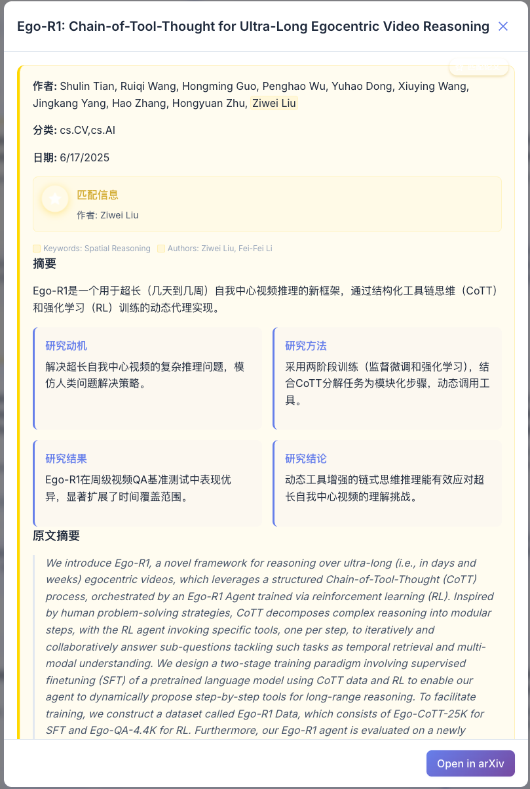
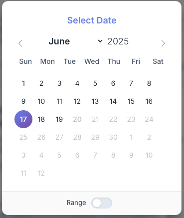
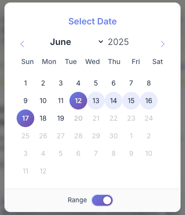
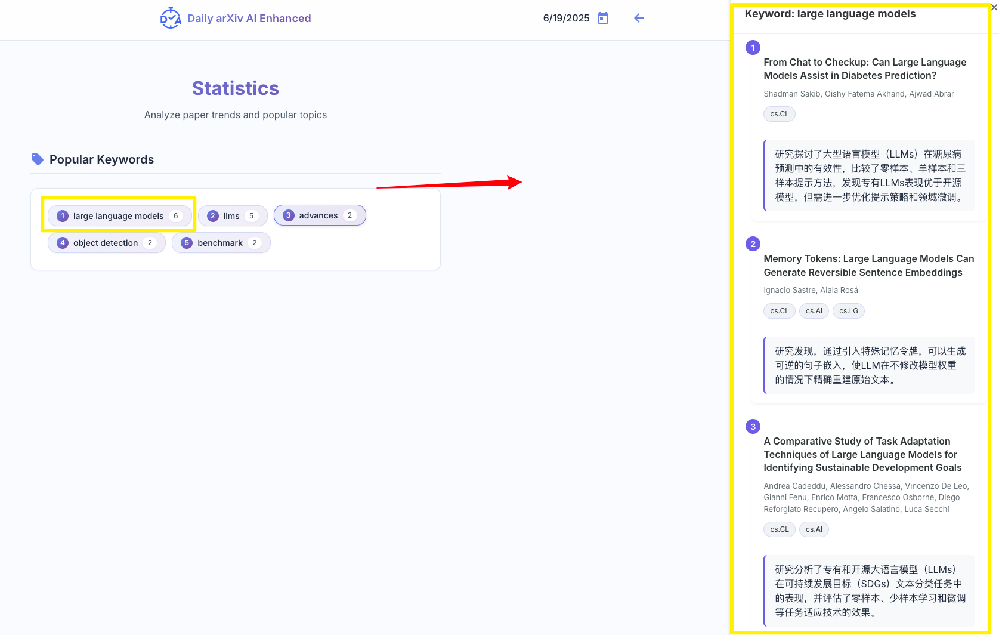
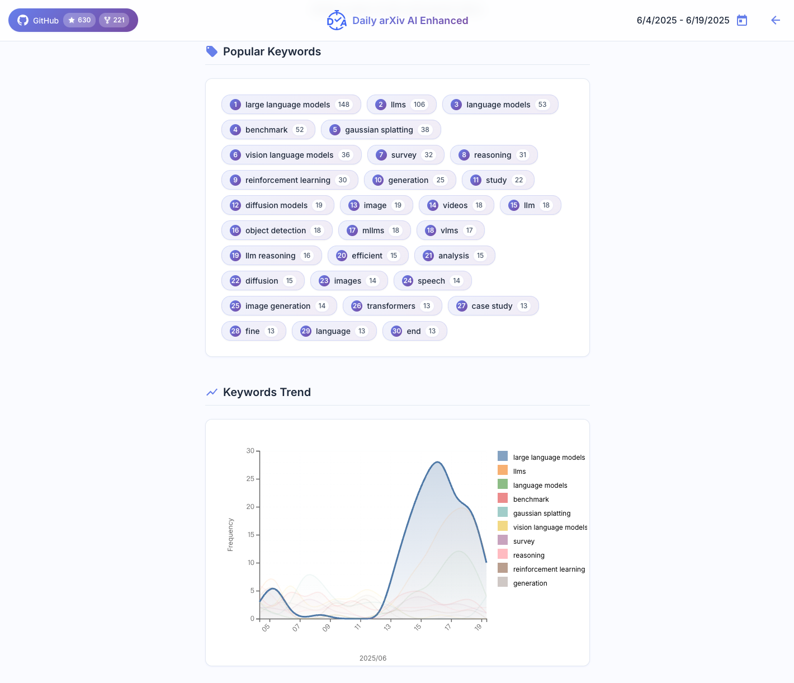

[TOC]

# Thanks

感谢原作者：[dw-dengwei/daily-arXiv-ai-enhanced](https://github.com/dw-dengwei/daily-arXiv-ai-enhanced)  的项目  

# Custom List

根据自己的需要，做了如下修改：
* 🔧 原逻辑：使用环境变量中指定的 `CATEGORIES=cs.CL,cs.CV` 类别，调用`scrapy`进行爬取。现逻辑：将爬取源切换为 `arXiv 的高级搜索`页面，根据预置仓库环境变量`SEARCH_TERMS`关键词进行关键词查询。
* 🧠 修改每天最多根据关键词爬取 200 篇论文，以节省开销。（arXiv 的高级搜索页面限制）
* 🧠 调用LLM API增加延迟，根据预置仓库环境变量`API_DELAY_SECONDS`，避免连续快速调用LLM API 触发限制。
* 🧪 环境变量举例：
   * SEARCH_TERMS = fraud detect, spreadsheet excel fault predict
   * API_DELAY_SECONDS = 15

# TODO
TODO Lists：
- [🎯 ] 增加每日爬取最多论文的限制；

# 恰饭

1. 

2. 开发者需要免费服务的，推荐使用每个月免费$5额度的云服务。
[https://console.run.claw.cloud/signin?link=XHJEEP7HEVIR](https://console.run.claw.cloud/signin?link=XHJEEP7HEVIR)

3. [Cloudcone VPS](https://app.cloudcone.com/?ref=12850)

----------

# 🚀 daily-arXiv-ai-enhanced

> Your AI-powered daily digest of arXiv papers - making research reading smarter and more personalized!

This innovative tool transforms how you stay updated with arXiv papers by combining automated crawling with AI-powered summarization.

## ✨ Key Features

🎯 **Zero Infrastructure Required**
- Leverages GitHub Actions and Pages - no server needed
- Completely free to deploy and use

🤖 **Smart AI Summarization**
- Daily paper crawling with DeepSeek-powered summaries
- Cost-effective: Only ~0.2 CNY per day during off-peak hours

💫 **Smart Reading Experience**
- Personalized paper highlighting based on your interests
- Cross-device compatibility (desktop & mobile)
- Local preference storage for privacy
- Flexible date range filtering

👉 **[Try it now!](https://dw-dengwei.github.io/daily-arXiv-ai-enhanced/)** - No installation required

# Screenshots
- Main page. Highlight the interested keywords and authors.

- Setting page. Set up keywords and authors and store them in your browser.

- Detail page. Show details of the paper you clicked.

- Date select. Enable selecting a single date or a date range for filtering papers (**Notice: a large date range will show lots of papers, which may lead your browser to get stuck.**).

- Statistics page (*in developing*). Help you analyze papers. Extract keywords for papers in the day(s) you select. In addition, if you select a range of dates, the keyword trends will be illustrated. (Fortunately, selecting a large range of papers **will not** stuck your browser to be stuck because this page will not show all papers. It may take a few seconds to process the keywords.)

# How to use
This repo will daily crawl arXiv papers about **cs.CV, cs.GR, cs.CL and cs.AI**, and use **DeepSeek** to summarize the papers in **Chinese**.
If you wish to crawl other arXiv categories, use other LLMs, or other languages, please follow the instructions.
Otherwise, you can directly use this repo in https://dw-dengwei.github.io/daily-arXiv-ai-enhanced/. Please star it if you like :)

**Instructions:**
1. Fork this repo to your own account
2. Go to: your-own-repo -> Settings -> Secrets and variables -> Actions
3. Go to Secrets. Secrets are encrypted and used for sensitive data
4. Create two repository secrets named `OPENAI_API_KEY` and `OPENAI_BASE_URL`, and input corresponding values.
5. Go to Variables. Variables are shown as plain text and are used for non-sensitive data
6. Create the following repository variables:
   1. `CATEGORIES`: separate the categories with ",", such as "cs.CL, cs.CV"
   2. `LANGUAGE`: such as "Chinese" or "English"
   3. `MODEL_NAME`: such as "deepseek-chat"
   4. `EMAIL`: your email for push to GitHub
   5. `NAME`: your name for push to GitHub
7. Go to your-own-repo -> Actions -> arXiv-daily-ai-enhanced
8. You can manually click **Run workflow** to test if it works well (it may take about one hour). By default, this action will automatically run every day. You can modify it in `.github/workflows/run.yml`
9. Set up GitHub pages: Go to your own repo -> Settings -> Pages. In `Build and deployment`, set `Source="Deploy from a branch"`, `Branch="main", "/(root)"`. Wait for a few minutes, go to https://\<username\>.github.io/daily-arXiv-ai-enhanced/. Please see this [issue](https://github.com/dw-dengwei/daily-arXiv-ai-enhanced/issues/14) for more precise instructions.

# To-do list
- [x] Feature: Replace markdown with GitHub pages front-end.
- [ ] Bugfix: In the statistics page, the number of papers for a keyword is not correct.
- [ ] Bugfix: In the date picker, the date and week do not correspond.
- [ ] Feature: Extract keywords with DeepSeek.
- [x] Update instructions for fork users about how to use GitHub Pages.

# Contributors
Thanks to the following special contributors for contributing code, discovering bugs, and sharing useful ideas for this project!!!
<table>
  <tbody>
    <tr>
      <td align="center" valign="top">
        <a href="https://github.com/JianGuanTHU"> <b>JianGuanTHU</b></a> 
      </td>
      <td align="center" valign="top">
        <a href="https://github.com/Chi-hong22"> <b>Chi-hong22</b></a> 
      </td>
      <td align="center" valign="top">
        <a href="https://github.com/chaozg"> <b>chaozg</b></a> 
      </td>
      <td align="center" valign="top">
        <a href="https://github.com/quantum-ctrl"> <b>quantum-ctrl</b></a> 
      </td>
      <td align="center" valign="top">
        <a href="https://github.com/Zhao2z"> <b>Zhao2z</b></a> 
      </td>
    </tr>
  </tbody>
</table>

# Acknowledgement
We sincerely thank the following individuals and organizations for their promotion and support!!!
<table>
  <tbody>
    <tr>
      <td align="center" valign="top">
        <a href="https://x.com/GitHub_Daily/status/1930610556731318781"> <b>Github_Daily</b></a> 
      </td>
      <td align="center" valign="top">
        <a href="https://x.com/aigclink/status/1930897858963853746"> <b>AIGCLINK</b></a> 
      </td>
      <td align="center" valign="top">
        <a href="https://www.ruanyifeng.com/blog/2025/06/weekly-issue-353.html"> <b>阮一峰的网络日志   科技爱好者周刊   （第 353 期）</b></a> 
      </td>
      <td align="center" valign="top">
        <a href="https://hellogithub.com/periodical/volume/111"> <b>《HelloGitHub》  月刊第 111 期</b></a> 
      </td>
    </tr>
  </tbody>
</table>

# Star history

# 友情赞助商

1. 

2. 开发者需要免费服务的，推荐使用每个月免费$5额度的云服务。
[https://console.run.claw.cloud/signin?link=XHJEEP7HEVIR](https://console.run.claw.cloud/signin?link=XHJEEP7HEVIR)

3. [Cloudcone VPS](https://app.cloudcone.com/?ref=12850)

4. 

5. [DMIT](https://www.dmit.io/aff.php?aff=23825)

